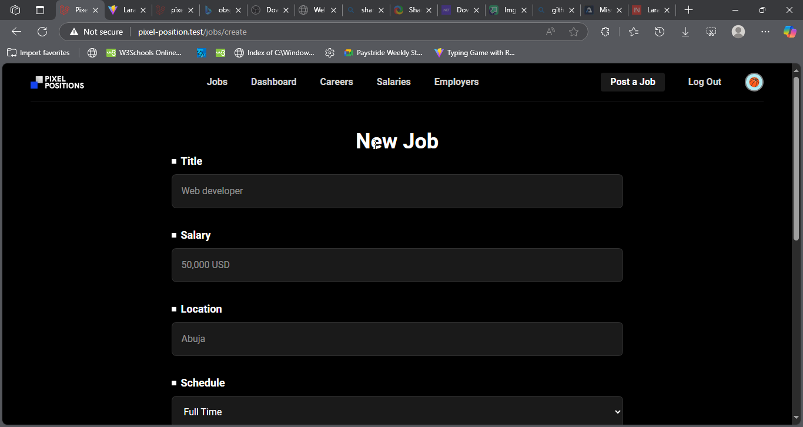
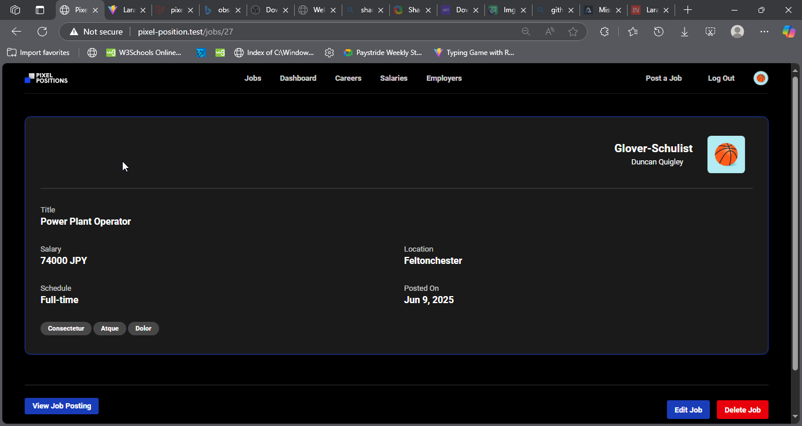
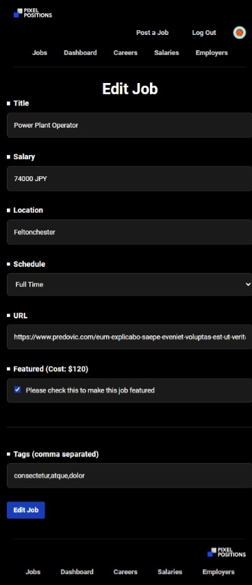

# 👨‍🔧👨‍🚒👩‍🔬 Pixel Positions


[](https://laravel.com)

Pixel Positions is a Laravel-based job board built as a practice project 
from Laracasts' **"Learn Laravel in 30 Days"** series. 
It allows employers to post job listings and users to browse available positions.

---

## 🚀 Features

- ✅ User registration and authentication
- ✅ Employer dashboard to manage job posts
- ✅ Create, edit, and delete job listings
- ✅ Tag jobs with multiple categories
- ✅ Filter jobs by tags
- ✅ Upload and display company logos
- ✅ Responsive UI using Tailwind CSS
- ✅ Fully tested with Pest (feature and model tests)
- ✅ API & SSR-ready setup using Laravel Vite

---

## 📸 Screenshots

### Home Page
View a collection of featured jobs and recently posted jobs\


### Register
Create an account with a corresponding employer to post a job\  


### Create New Job
Logged-in users can post a new job as an employer\


### Meet Our Employers
Browse a list of employers and take a look at their available jobs\


### View Job
Get all the information you need about a job at a glance\


### Edit Job
Logged-in users can edit the jobs they created\



---

## 🛠️ Tech Stack

- **Backend**: Laravel 12 (specify version)
- **Frontend**: Blade
- **Styling**: Tailwind CSS v4
- **Database**: SQLite
- **Testing**: PestPHP
- **Dev Tools**: Laravel Vite

---

## 📦 Installation

1. **Clone the repository**
   ```bash
   git clone https://github.com/your-username/pixel-positions.git
   cd pixel-positions
   ```
2. **Install dependencies**
    ```bash
   composer install
   npm install
    ```
3. **Environment setup**
    ```bash
   cp .env.example .env
   php artisan key:generate
    ```
4. **Database setup**
   - Update `.env` with your DB credentials
   - Run migrations and seeders
    ```bash
   php artisan migrate --seed
   ```
5. **Run dev server**
    ```bash
   php artisan serve
   npm run dev
    ```

---

## 🧪 Running tests
```bash
php artisan test
# OR
./vendor/bin/pest
```

---

## 🧑‍💻 Author
- Peter Franklyn
- GitHub: @FranklinEkemezie
- X: @ThatWebArtisan

---

## 📄 License
This project is open-source and free to use for educational purposes.
